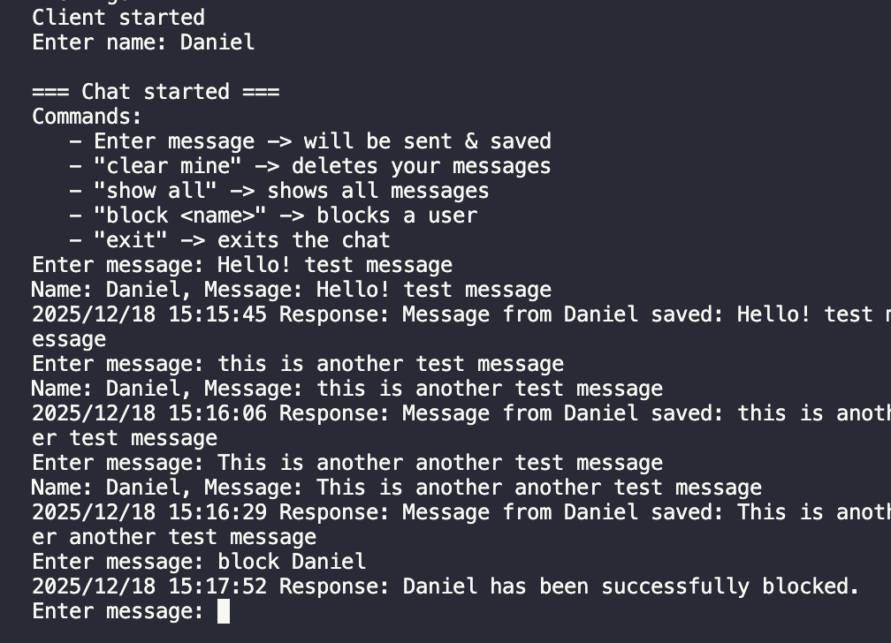
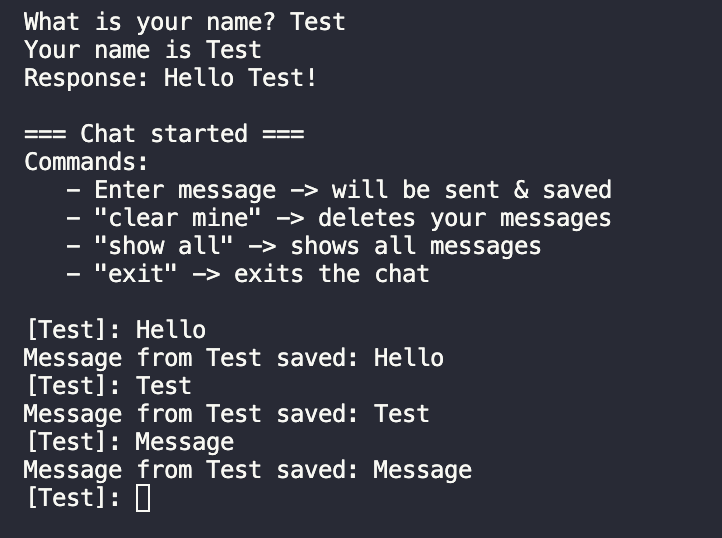
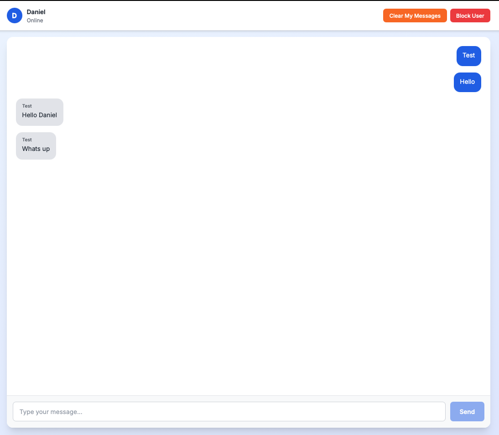
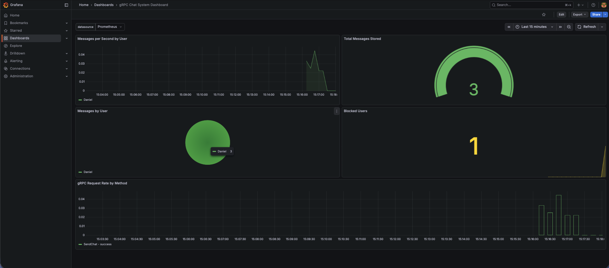
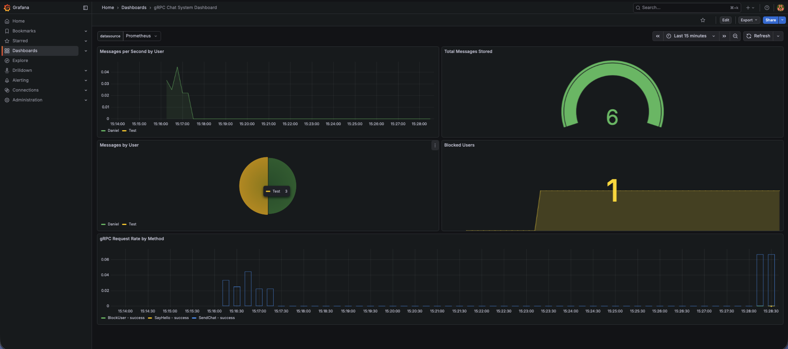
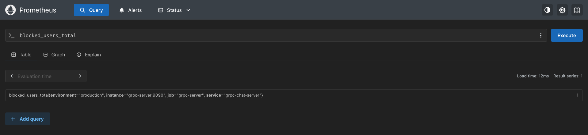
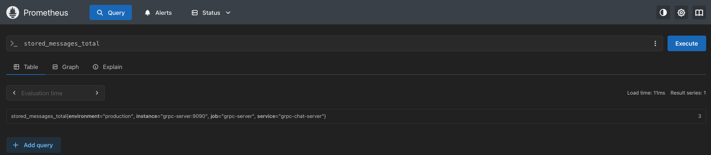

# gRPC Multi-Client Chat System with Observability

## 📑 Table of Contents

1. [PVL Project Overview](#pvl-project-overview)
2. [System Features](#system-features)
3. [Architecture](#architecture)
4. [Project Structure](#project-structure)
5. [Quick Start with Docker](#quick-start-with-docker-recommended)
6. [Local Development Setup](#local-development-setup)
7. [gRPC API Methods](#grpc-api-methods)
8. [Observability & Monitoring](#observability--monitoring-osscncf-integration)
9. [System Screenshots](#-system-screenshots)
10. [Technologies Used](#technologies-used)
11. [Testing the System](#testing-the-system)

## PVL Project Overview

This PVL-project fulfills all requirements for the **Distributed Systems in Docker** lab task:

- **Multi-service Architecture:** gRPC Server + Multiple Clients
- **Dockerized Deployment:** Complete docker-compose setup
- **OSS/CNCF Integration:** Prometheus + Grafana for observability
- **Full Documentation:** Architecture, usage, and demonstration guides
- **Code Quality:** TypeScript/Go with clean structure

## System Features

### Core Chat Functionality
- **Multi-client support:** Go and TypeScript clients
- **Real-time messaging:** gRPC-based communication
- **User management:** Block/unblock users
- **Message operations:** Send, view all, clear own messages
- **In-memory storage:** Session-persistent message storage

### Observability (CNCF Tools)
- **Prometheus:** Metrics collection and time-series storage
- **Grafana:** Real-time dashboards and visualization
- **Custom Metrics:** Request rates, message counts, user activity
- **System Metrics:** CPU, memory, and Node.js internals
- **Health Monitoring:** HTTP health check endpoint

## Architecture

```
Web Browser ────HTTP────> Next.js Frontend (:3001)
                               │
                               │ gRPC
                               ▼
Clients (Go/TS) ──gRPC──> Server (Node.js) ──metrics──> Prometheus ──query──> Grafana
     :50051                    :9090                       :9091            :3000
```

## Project Structure

```
grpc-multiclient-chat/
├── greeter.proto              # Protocol Buffer service definition
├── server.ts                  # TypeScript gRPC server with metrics
├── client.ts                  # TypeScript interactive client
├── client.go                  # Go interactive client
├── proto/                     # Generated Go protobuf files
├── frontend/                  # Next.js web UI (NEW!)
│   ├── app/                   # Next.js 14 app directory
│   │   ├── api/              # API routes (gRPC bridge)
│   │   ├── page.tsx          # Main chat UI
│   │   └── layout.tsx        # Root layout
│   ├── lib/                   # Utilities
│   └── package.json          # Frontend dependencies
├── Dockerfile.server          # Server container image
├── Dockerfile.client          # Client container image
├── Dockerfile.frontend        # Frontend container image (NEW!)
├── docker-compose.yml         # Complete system orchestration
├── prometheus/
│   └── prometheus.yml         # Prometheus configuration
├── grafana/
│   └── provisioning/          # Grafana datasource config
└── README.md                  # This file
```

## Quick Start with Docker (Recommended)

### Prerequisites
- **Docker Desktop** (with Docker Compose)
- **Git**

### Start Everything in One Command

```bash
# Clone repository
git clone <repository-url>
cd grpc-multiclient-chat

# Start all services (server, Prometheus, Grafana)
docker-compose up -d

# View logs
docker-compose logs -f grpc-server
```

### Access Services

- **🌐 Web Chat UI:** http://localhost:3001 -> Open up two tabs to chat with yourself :)
- **gRPC Server:** `localhost:50051`
- **Metrics Endpoint:** http://localhost:9090/metrics
- **Health Check:** http://localhost:9090/health
- **Prometheus UI:** http://localhost:9091
- **Grafana Dashboard:** http://localhost:3000 (admin/admin)

### Use the Chat System

**Web Interface - Recommended**
```bash
# Simply open your browser
open http://localhost:3001

# Login with your name and start chatting!

# Open up 2 https://localhost:3001 windows to chat with yourself :) 
```

**Classic Terminal Clients:**
```bash
# Option 1: Run Go client locally (requires Go installed)
go run client.go

# Option 2: Run TypeScript client locally (requires Node.js)
npm install
npm run client

# Option 3: Run in Docker (uncomment in docker-compose.yml)
docker-compose run --rm grpc-client
```

---

## Local Development Setup

### Prerequisites
- **Go** (1.21 or higher)
- **Node.js** (18 or higher)
- **Protocol Buffers Compiler** (`protoc`)

### Install Protocol Buffer Tools

```bash
# Install protoc plugins for Go
go install google.golang.org/protobuf/cmd/protoc-gen-go@latest
go install google.golang.org/grpc/cmd/protoc-gen-go-grpc@latest

# Add to PATH
export PATH="$PATH:$(go env GOPATH)/bin"
```

### Local Installation

1. **Install Node.js dependencies**
   ```bash
   npm install
   ```

2. **Install Go dependencies**
   ```bash
   go mod download
   ```

### Starting the Server Locally

```bash
npm run server
```

You should see:
```
- gRPC server running on port 50051...
- Metrics server running on http://0.0.0.0:9090/metrics
- Health check available at http://0.0.0.0:9090/health
```

### Running the Client Locally

**Go Client:**
```bash
go run client.go
```

**TypeScript Client:**
```bash
npm run client
```

### Example Session

```
What is your name? Alice
Your name is Alice
Response: Hello Alice!

=== Chat started ===
Commands:
   - Enter message -> will be sent & saved
   - "clear mine" -> deletes your messages
   - "show all" -> shows all messages
   - "exit" -> exits the chat

[Alice]: Hello everyone!
✓ Message from Alice saved: Hello everyone!

[Alice]: show all
=== All Messages ===
   1. [Alice]: Hello everyone!
==========================

[Alice]: clear mine
✓ 1 message(s) from Alice were deleted

[Alice]: exit
Chat ended.
```

## gRPC API Methods

### SayHello
Initial greeting when user connects
- **Request:** `HelloRequest { name: string }`
- **Response:** `HelloReply { message: string }`

### SendChat
Send a chat message
- **Request:** `ChatRequest { user: string, message: string }`
- **Response:** `Recived { message: string }`
- **Metrics:** Increments `chat_messages_total`, updates `stored_messages_total`

### BlockUser
Block a user from sending messages
- **Request:** `BlockRequest { username: string }`
- **Response:** `BlockResponse { message: string, success: bool }`
- **Metrics:** Updates `blocked_users_total`

### ClearMyMessages
Delete all messages from current user
- **Request:** `ClearRequest { user: string }`
- **Response:** `ClearResponse { message: string, deleted_count: int32 }`
- **Metrics:** Increments `messages_deleted_total`, updates `stored_messages_total`

### GetAllMessages
Retrieve all stored messages
- **Request:** `Empty {}`
- **Response:** `MessagesResponse { messages: [ChatMessage] }`
- **Metrics:** Increments `grpc_requests_total`

## Observability & Monitoring (OSS/CNCF Integration)

### Prometheus Metrics

Visit http://localhost:9090/metrics to see the metrics:

**Custom Metrics:**
- `grpc_requests_total` - Total gRPC requests by method and status
- `chat_messages_total` - Messages sent per user
- `blocked_users_total` - Current number of blocked users
- `stored_messages_total` - Current message count in storage
- `messages_deleted_total` - Deleted messages per user

### Grafana Dashboards

**Pre-built Dashboard:** A complete dashboard is included and should load automatically!

**Quick access:**
1. Open http://localhost:3000
2. Login with `admin` / `admin`
3. Navigate to "Dashboards" → "gRPC Chat System Dashboard"

### Health Check

```bash
curl http://localhost:9090/health
```

Response:
```json
{
  "status": "healthy",
  "service": "grpc-chat-server",
  "timestamp": "2025-12-17T...",
  "metrics": {
    "totalMessages": 42,
    "blockedUsers": 2
  }
}
```

## 📸 System Screenshots

### Multi-Client Chat in Action

The following screenshots demonstrate the complete system functionality with multiple concurrent clients:

#### Terminal Clients

**Client 1 - User Interaction:**



*Shows a user connecting, sending messages, and using chat commands like "show all" and "clear mine".*

**Client 2 - Concurrent Communication:**



*Demonstrates multiple users chatting simultaneously, showcasing the real-time multi-client capability.*

#### Web UI Interface

**Next.js Chat Application:**



*Modern web interface built with Next.js 15 and React 19, providing an intuitive browser-based chat experience with real-time updates.*

### Observability Dashboards

#### Grafana Dashboard - System Overview



*Complete Grafana dashboard showing gRPC request metrics, message statistics, and system health in real-time.*

#### Grafana Dashboard - Multiple Users



*Dashboard visualization with active metrics from multiple concurrent users, demonstrating scalability.*

### Prometheus Metrics

#### Blocked Users Metric



*Prometheus graph showing the `blocked_users_total` metric over time, tracking user moderation.*

#### Stored Messages Metric



*Prometheus visualization of `stored_messages_total`, tracking message persistence and growth.*

---

## Technologies Used

### Core Technologies
- **gRPC**: High-performance RPC framework (CNCF)
- **Protocol Buffers**: Efficient serialization
- **Docker & Docker Compose**: Containerization
- **TypeScript/Node.js**: Server implementation
- **Go**: Client implementation

### OSS/CNCF Tools
- **Prometheus**: Metrics collection and storage (CNCF Graduated)
- **Grafana**: Visualization and dashboards
- **prom-client**: Prometheus client for Node.js
- **Express**: HTTP server for metrics endpoint

### Libraries
- `@grpc/grpc-js` - Node.js gRPC implementation
- `@grpc/proto-loader` - Dynamic proto loading
- `google.golang.org/grpc` - Go gRPC library

## Testing the System

### 1. Start the system
```bash
docker-compose up -d
```

### 2. Verify services are running
```bash
docker-compose ps
curl http://localhost:9090/health
```

### 3. Run multiple clients simultaneously
```bash
# Terminal 1
go run client.go

# Terminal 2
npm run client

# Terminal 3
go run client.go
```

### 4. Send messages and observe metrics
- Send messages from different clients
- Visit http://localhost:9090/metrics
- Watch Prometheus at http://localhost:9091
- Create Grafana dashboard at http://localhost:3000

### 5. Test features
- Block a user: Type `block <username>` in Go client
- View all messages: Type `show all`
- Clear your messages: Type `clear mine`